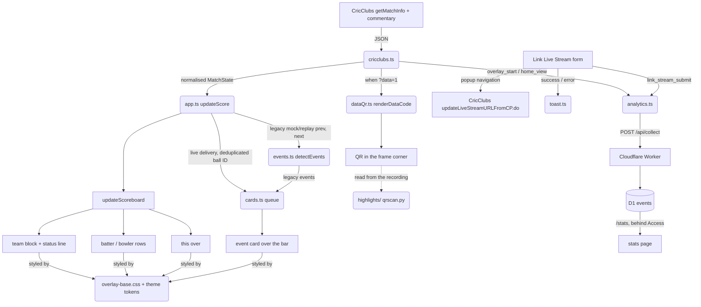

# overlay.md — the overlay application

**Load before changing anything under `src/`.**

A cricket scorecard overlay for OBS/vMix browser sources. Vite + TypeScript, no framework. It
polls the current public CricClubs match-info and commentary endpoints through `cricclubs.ts`
and the same-origin `/api/cricclubs/match` proxy every 1.5 seconds by default, then paints a
fixed-position DOM. Everything is driven by URL query params; the
user-facing table is in [README.md](../README.md).

---

## 1. Entry and the poll loop

`index.html` loads `src/script.ts` as a module. `script.ts` imports only the Montserrat font
CSS and `css/instructions.css` — theme CSS is imported by `theme.ts` — then calls into
`src/app.ts`, which holds all orchestration and is where the tests point.

`app.ts` does two things on startup: wires the Link Live Stream form once
(`setupLinkStreamForm`), and runs `pollLoop()`.

🛑 **`pollLoop()` is a timeout chain, not `setInterval`.** It awaits `updateScore()` and only
then re-arms a `setTimeout` using `?refresh=` or `CONFIG.REFRESH_RATE`, so a slow CricClubs response can never
overlap the next poll. Do not "simplify" this to an interval.

A failed fetch keeps the last rendered frame once one has painted, and shows "Connecting…"
before the first successful render. That asymmetry is deliberate: a single dropped poll
mid-broadcast must not flash an error at viewers, but a wrong `matchId` has to be visible to
whoever is setting the source up.

## 2. The mode switch

`updateScore()` branches in this order:

1. no `matchId`, no `debug`, not `mode=replay` → show `#instructions`, hide `.overlay`
2. `mode=replay` → cycle `replayData.ts`
3. `debug=1..5` → static state from `mockData.ts`
4. otherwise → fetch live

Mock and replay fixtures are cast `as unknown as CricketAPIData` because they do not fill
every field of the (large) type in `types.ts`.

## 3. Rendering discipline

`src/ui.ts` owns the DOM. `updateScoreboard()` picks team 1 vs team 2 fields from
`values.isSecondInningsStarted === "true"`, then writes through `setText`/`setDisplay` helpers
that only touch the DOM when a value actually changed, to avoid layout thrash.

⚠ **API booleans are strings.** `isSecondInningsStarted` is `"true"`, and `isMatchEnded` is
`"1"`. Comparing them as booleans silently fails.

`statusText()` supplies the CRR / Target tail on the score row and the Need / RRR third row in
a chase, computed from the totals rather than from CricClubs' pre-built HTML message. There is
no separate second-innings strip any more.

`updateTeamLogos()` caches by URL so polling does not refetch images. Logo URLs from the API
may be relative; it prefixes `https://cricclubs.com`.

## 4. 🛑 `dom.ts` runs `getElementById` at import time

`DOM` is a plain object of element references resolved when the module first loads. Every
consequence below has bitten:

- Anything importing `dom.ts` (`ui.ts`, `theme.ts`, `script.ts`) needs the real `index.html`
  structure present at import.
- **In tests, never import `dom.ts` directly.** `ui.test.ts` does `vi.mock('./dom', ...)` with
  a Proxy mapping property names to element IDs, looked up lazily *after* `beforeEach` has
  built the elements. Follow that pattern for any new test touching `ui.ts`. `app.test.ts`
  instead mocks every collaborator (`./cricclubs`, `./ui`, `./theme`, `./analytics`, `./toast`,
  `./liveStream`) and asserts on calls.
- Modules with state expose `reset*ForTests()` hooks (`app.ts`, `ui.ts`, `analytics.ts`,
  `dataQr.ts`) — call them in `beforeEach` rather than reaching into module internals.
- **Adding an element means adding it in three places**: `index.html`, `dom.ts`, and the
  `idMap` in `ui.test.ts`. Miss the third and the test suite fails confusingly.
- The Worker has its own `worker/vitest.config.ts` (node environment). Without it Vitest walks
  up and uses the site's jsdom config. The root config restricts `include` to `src/**` so the
  two suites never mix.

## 5. Theming: one layout, many token sets

`applyTheme()` puts a `theme-<name>` class on `<body>`. Unknown names fall back to
`modern-light`, and `modern` is kept as an alias in `THEME_ALIASES`.

All 16 themes share one layout, `src/css/overlay-base.css` — an ICC-style lower third: batting
logo, brand-coloured team block, two batter rows, bowler row with this-over balls, bowling
logo. Each `theme-*.css` is **only** a block of ~22 colour tokens on `.theme-<name>`; the token
list is documented at the top of the base file.

🛑 **Never put layout in a theme file. Change the base.**

The base uses px deliberately — the overlay renders on a fixed 1920×1080 broadcast canvas, not
in a browser someone zooms — and it respects `prefers-reduced-motion`.

The striker is marked with the static `on-strike` class on the **first batter row** in
`index.html`, not with text. The API's ordering is what marks it, which is why `batsman1` is
always the striker for anything reading the feed — see [data-code.md](./data-code.md) §2.

**Adding a theme**: copy any `theme-*.css` and change the tokens, `import` it in `theme.ts`,
add the name to `AVAILABLE_THEMES`, add a `theme-tag tag-<name>` link in the `index.html` theme
grid plus its `.tag-<name>` colours in `instructions.css`, and update the theme lists in
`README.md`.

The 16: `classic`, `modern-light` (default), `modern-dark`, `neon`; the ten IPL franchises
`kkr`, `rcb`, `mi`, `csk`, `dc`, `rr`, `srh`, `pbks`, `gt`, `lsg`; and `topguns-light`,
`topguns-dark` (old `tel`/`ted`/`tul`/`tud` names remain aliases).

## 6. Event cards

For live data, `app.ts` uses `overlayEventFor()` from the normalized newest real delivery,
deduplicates by stable ball ID, and calls `enqueueCards()` (`src/cards.ts`). Cards play one at
a time over the batter/bowler slots. Legacy mock/replay data still uses
`detectEvents(prev, next)` (`src/events.ts`, pure and tested).

| Card | Trigger | Holds |
|---|---|---|
| Wicket | the newest real delivery is a wicket | 8 s |
| Fifty / Hundred (legacy mock/replay) | a batter crosses 50 or 100 | 8 s |
| Four / Six | the newest ball is a boundary off the bat | 2 s |
| 50 / 100 partnership (legacy mock/replay) | the current stand crosses 50 or 100 | 6 s |

Hold times live in `HOLD_MS`. ⚠ **The exit transition length is duplicated** between `cards.ts`
(`TRANSITION_MS`) and the `.event-card` CSS — keep them equal.

Adding a card type means: a new `OverlayEvent` variant, a detection rule, `cardCopy()` text, a
`HOLD_MS` entry, a `SAMPLE_EVENTS` entry (for `?debug=1&card=<type>`), and usually a
`[data-type]` CSS rule.

**Cards are the only thing that may cover the bar; the team block must always stay visible.**

Live cards use `HOLD_MS` and clear automatically, followed by a 300 ms exit transition.
Unchanged polls and recovery of an already processed ball do not enqueue the event again.

### 6a. 🛑 The accent palette is a contract, not decoration

Each card type has its own fixed colour, declared once in `overlay-base.css` and **never**
overridden by a theme:

| Token | Colour | | Token | Colour |
|---|---|---|---|---|
| `--ob-wicket` | `#d7263d` | | `--ob-milestone` | `#ff7300` |
| `--ob-four` | `#1b9e4b` | | `--ob-partnership` | `#00bcd4` |
| `--ob-six` | `#6d3df5` | | | |

`highlights/` identifies what happened in a recording from that 5 px stripe alone, so changing
a value or letting a theme re-theme one **silently breaks highlight detection on every future
match**. The five are chosen for maximum channel distance from each other, at least 150 apart
on a 0–765 summed-RGB scale. If you add a card type, pick a colour at least that far from all
of them and record it in [highlights.md](./highlights.md) §5.

Milestone and partnership only got their own colours in `3f0a282`; before that they fell back
to the theme's brand accent, which collides with the team block in the topguns themes.

### 6b. ⚠ A boundary off an illegal delivery arrives fused with the penalty

A six off a no-ball reaches the overlay as **`7nb`**, not `6`. `detectEvents()` exact-matched
`'4'` and `'6'`, so no card fired and the ball disc was coloured amber as a plain no-ball — the
shot was then invisible to `highlights/` too. Fixed in `c455921`.

`runsOffBat()` in `src/utils.ts` now parses runs off the bat and both call sites use it.
Scorers are inconsistent about including the penalty, so **`6nb` and `7nb` are both a six**.
Wides, byes and leg-byes score nothing off the bat however many runs they carry, so a boundary
from one is not a batting boundary. The disc prints the raw outcome, so recolouring keeps
"7nb" legible.

## 7. The home page

`#instructions` is plain HTML in `index.html` styled by `css/instructions.css` (light/dark
tokens prefixed `--h-`). Its URL builder lives in `urlBuilder.ts`.

⚠ **Keep the element ids stable** — `app.test.ts` and `urlBuilder.test.ts` mount minimal copies
of that markup.

## 8. 🛑 Link Live Stream must stay a popup, not a fetch

`src/liveStream.ts` attaches a YouTube URL to a CricClubs match via
`updateLiveStreamURLFromCP.do`. CricClubs blocks that endpoint as a cross-origin **subresource**
— a `Cross-Origin-Resource-Policy` check plus WAF heuristics — so `fetch` (including
`mode: 'no-cors'`), `` and `<iframe>` all fail.

A genuine top-level navigation is not a subresource load, so it escapes both checks. The
working approach is `window.open` in a small popup, **synchronously inside the submit handler**
(required for the browser to allow it), closed after about two seconds.

**Do not "simplify" this back to `fetch`.** Commits `25ceb63` and `f7459e3` document the failed
attempts.

There is also no client-side way to verify the update landed — CricClubs' own feed lags by up
to a minute — so the success copy says "submitted", not "linked". `LinkLiveStreamError` carries
a `code` (`invalid_url` | `popup_blocked`) so the outcome can be reported to analytics.

## 9. Configuration

`CONFIG` (`src/config.ts`) holds the refresh rate, the default club ID (LPCL, `1089463`), the
`?logo=` → sponsor image map (images imported from `src/assets/images/` so Vite bundles them),
and the analytics endpoint.

`vite.config.ts` sets `base: './'` for relative paths in overlays. 🛑 **Don't change it.**

## 10. Commands

```bash
npm run dev            # Vite dev server on http://localhost:5173
npm run test           # vitest watch mode
npm run test:run       # single run — this is what build and CI use
npm run test:coverage  # v8 coverage table (also available in worker/)
npx vitest run src/utils.test.ts            # one test file
npx vitest run -t "should return wicket"    # one test by name
npx tsc                # typecheck only (noEmit; strict + noUnusedLocals + noImplicitReturns)
npm run build          # tsc && test:run && vite build -> dist/ (dist is gitignored)
npm run preview        # serve the production build
```

There is no linter. ⚠ **`npm run build` fails on type errors *and* test failures** — run it
before opening a PR. CI (`.github/workflows/ci.yml`) runs the site build and the Worker
typecheck/tests on every PR.

Branch naming in history is `feature/…`, `fix/…`, `docs/…`; commit subjects use conventional
prefixes (`feat:`, `fix:`, `docs:`, `ci:`, `test:`).

## 11. Project structure

```text
cricket-scorecard-overlay/
├── docs/               # this knowledge bundle (OKF v0.2)
├── worker/             # Cloudflare Worker: /api/cricclubs/*, /api/collect and /stats
│   ├── src/index.ts    # router
│   ├── src/collect.ts  # event validation / normalisation (pure, tested)
│   ├── src/stats.ts    # aggregate queries + server-rendered stats page
│   ├── src/access.ts   # Cloudflare Access JWT verification
│   ├── migrations/     # D1 schema
│   └── wrangler.toml   # routes, D1 binding, Access vars
├── highlights/         # reads a recording, cuts reels (Python)
├── src/
│   ├── script.ts       # entry: fonts/CSS, then app.ts
│   ├── app.ts          # pollLoop(), updateScore() mode switch, renderFrame()
│   ├── cricclubs.ts    # current public API adapter + normalised MatchState
│   ├── ui.ts           # updateScoreboard() / updateBallByBall() / updateTeamLogos()
│   ├── events.ts       # detectEvents(prev, next) — pure poll diff
│   ├── cards.ts        # event-card queue, copy, hold times, sample cards
│   ├── dataCode.ts     # 🛑 the ?data=1 wire format (see data-code.md)
│   ├── dataQr.ts       # packs the payload and draws the QR
│   ├── theme.ts        # applyTheme() / updateLogo()
│   ├── liveStream.ts   # 🛑 the popup workflow (see §8)
│   ├── analytics.ts    # track() / trackOnce(), client detection, opt-out
│   ├── urlBuilder.ts   # home-page link builder
│   ├── dom.ts          # 🛑 element map, resolved at import time (see §4)
│   ├── config.ts       # CONFIG: refresh rate, default club, logo map
│   ├── types.ts        # the CricClubs response shape
│   ├── utils.ts        # getQueryParams(), runsOffBat(), getBallStyleClass()
│   ├── mockData.ts     # static states for ?debug=1-5
│   ├── replayData.ts   # sequence of states for ?mode=replay
│   ├── tools/          # build-time scripts; typechecked, never bundled
│   └── css/
│       ├── overlay-base.css   # the whole layout, shared by every theme
│       ├── theme-*.css        # one colour-token block each
│       └── instructions.css   # the home page
└── index.html          # DOM structure
```

## 12. Data flow



## 13. Where the simulator lives

`sim/` drives the real overlay in headless Chrome through a whole generated match and grades
the rules — peeks only while idle and never repeated, panels wait for their peeks, every card
timed, every dismissal explained by a score change. **Run it after any change to `views.ts`,
`cards.ts`, `events.ts` or `app.ts`**; unit tests did not catch the three bugs it found on its
first runs.

⚠ **It currently exists only on the `feature/cricclubs-views` branch (PR 13)**, so it cannot be
run from `main` or from `feature/highlight-markers`. The overlay hooks it relies on (`?api=`,
`?refresh=`, `?e2e` in `src/e2e.ts`) only work on localhost.

